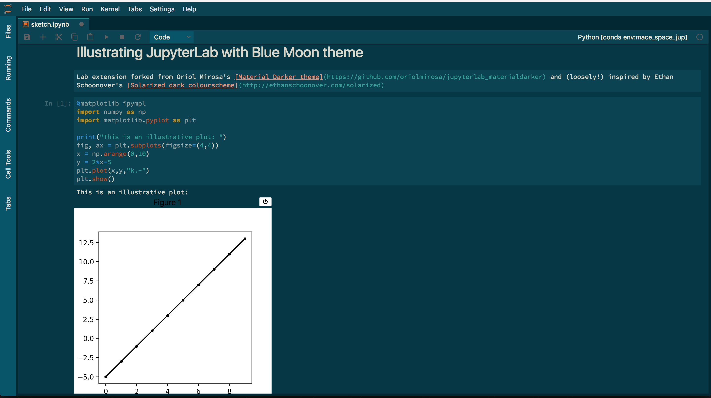

# Blue Moon JupyterLab Extension

This is my fork of the [Material Darker theme for JupyterLab](https://github.com/oriolmirosa/jupyterlab_materialdarker) by Oriol Mirosa. It's a work in progress. The colourscheme is **loosely** based on Ethan Schoonover's [Solarized dark theme](http://ethanschoonover.com/solarized).

## Install

The extension is not yet uploaded to npm, so in order to install it you need to clone the repository, enter the main directory, and run:

```
npm run build
jupyter labextension install
```

(If you get this error in the build process: `ERROR in Entry module not found: Error: Can't resolve 'style-loader'`, run `npm install style-loader --save` and try building again). You may need to run `npm install` for dependencies.

After launching JupyterLab, select the `Blue Moon` theme from the main menu: `Settings` > `JupyterLab Theme` > `Blue Moon`



